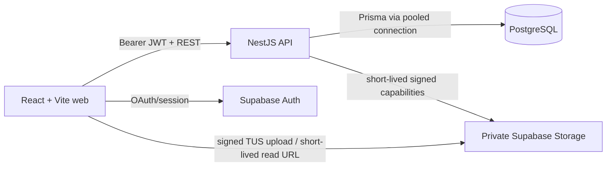
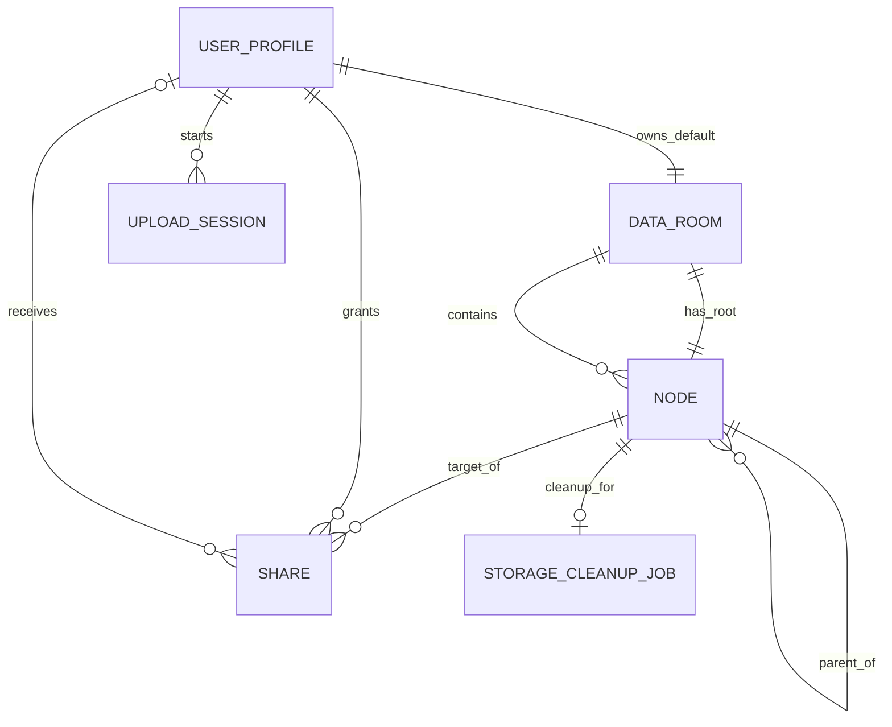

# Secure Data Room

> A production-minded Data Room MVP for organizing and securely sharing due-diligence PDFs.

<!-- RELEASE INTEGRATOR: replace every {{TOKEN}}, delete this comment, and remove any feature row
that is not backed by final-SHA code, tests, and a deployed smoke result. Never commit a broken GIF. -->

<p align="center">
  
</p>

<p align="center">
  <a href="{{WEB_URL}}">Live application</a> ·
  <a href="{{API_DOCS_URL}}">API / Swagger</a> ·
  <a href="{{PR_URL}}">Implementation PR</a>
</p>

## Two-minute reviewer tour

1. Open the live application and continue with Google. A private default Data Room is provisioned on first sign-in.
2. Create `Legal` → `Contracts`; use breadcrumbs to move between levels.
3. Drag two or more PDFs into `Contracts`. Each file exposes its own byte progress, success, retry, and cancel state.
4. Open a PDF in the app, rename it, and move it to `Legal`.
5. Create a public link and open it in an incognito window: no login, no access above the shared subtree.
6. For the permissioned path, share an item with a second Google identity, then open `Shared with me` in a separate browser profile.
7. Revoke that share and observe the explicit revoked state rather than stale content or a generic failure.
8. Delete a folder and review the exact nested folder/file/byte/active-share impact before confirming.

No passwords or private credentials are stored in this repository. The public-link journey needs no account; the two-user journey can be exercised with any second Google identity controlled by the reviewer.

## Verified feature matrix

> The release integrator must replace `{{PASS_OR_REMOVE}}` with `PASS` only after the linked evidence exists. Remove rows that are not implemented.

| Capability | Status | Evidence |
|---|---:|---|
| Google authentication and private owner boundary | {{PASS_OR_REMOVE}} | `{{AUTH_EVIDENCE}}` |
| Nested folders, contents, breadcrumbs, rename | {{PASS_OR_REMOVE}} | `{{FOLDER_EVIDENCE}}` |
| Impact-aware recursive folder deletion | {{PASS_OR_REMOVE}} | `{{DELETE_EVIDENCE}}` |
| Multi-PDF drag/drop with per-file real progress | {{PASS_OR_REMOVE}} | `{{UPLOAD_EVIDENCE}}` |
| In-app PDF view, rename, move, delete | {{PASS_OR_REMOVE}} | `{{FILE_EVIDENCE}}` |
| Public-link subtree sharing and revoke | {{PASS_OR_REMOVE}} | `{{PUBLIC_SHARE_EVIDENCE}}` |
| Permissioned read-only sharing and `Shared with me` | {{PASS_OR_REMOVE}} | `{{USER_SHARE_EVIDENCE}}` |
| Loading, empty, offline, conflict, quota, gone, revoked, invalid-link states | {{PASS_OR_REMOVE}} | `{{UX_STATE_EVIDENCE}}` |
| Responsive and keyboard-accessible mandatory flows | {{PASS_OR_REMOVE}} | `{{ACCESSIBILITY_EVIDENCE}}` |
| Public frontend and backend at one Git SHA | {{PASS_OR_REMOVE}} | `{{DEPLOYMENT_EVIDENCE}}` |

Optional filename search is listed only if it is a complete, tested vertical slice. File versioning is intentionally outside the deadline scope unless this sentence is replaced by verified implementation evidence.

## Why this repository is useful to review

- The architecture has one explicit application backend and one application-table data path.
- Business rules are expressed in domain language and protected by database constraints where races matter.
- API controllers remain thin; authorization is centralized; React components are split by user responsibility rather than arbitrary file size.
- The history is a sequence of real, independently reviewable increments with focused tests—not reconstructed or backdated “AI-looking” commits.
- The PR records requirements, alternatives, trade-offs, AI usage, verification evidence, and known limits.

## Architecture at a glance



**Boundary:** NestJS is the only application backend and authorization authority. The browser uses Supabase directly only for identity and a narrowly scoped signed Storage operation. It never queries application tables.

## Design decisions

### React/Vite instead of Next.js

This is an authenticated, interaction-heavy SPA with a dedicated NestJS backend. SSR, SEO, Server Components, Server Actions, and a frontend BFF do not solve a requirement here. Vite preserves a direct browser → NestJS boundary and avoids an unjustified second server runtime.

### One node model for room root, folders, and files

`Node` uses an adjacency list. A share can therefore target a Data Room root, folder, or file without three parallel share models. Renames and moves update PostgreSQL metadata; immutable random Storage keys never depend on user filenames or folder paths.

### Private direct uploads

PDF bodies do not pass through the serverless NestJS request path. The API verifies identity, ownership, parent state, quotas, type, and expected size; creates an expiring single-object upload session; and returns a signed Storage capability. The browser uploads with TUS for real per-file progress. Finalization verifies the object and is idempotent.

### Database invariants instead of hopeful pre-checks

A partial unique index enforces active sibling-name uniqueness across files and folders. Friendly application checks improve copy and suggestions, while the database remains authoritative when concurrent requests race.

### Recoverable cross-system deletion

PostgreSQL and blob storage do not share a transaction. One database transaction tombstones the subtree, revokes affected shares, and creates one idempotent cleanup job. Reads stop immediately. Bounded object cleanup can retry without resurrecting content; tombstoned metadata remains as the deadline-build audit/recovery record.

## Data model / ERD



The room root is the single active `Node` with `parentId = null`; there is no duplicated `rootNodeId`
pointer. The committed implementation contract is expressed by [`prisma/schema.prisma`](prisma/schema.prisma),
[`packages/contracts/`](packages/contracts/), and
[`docs/architecture/ADR-003-tree-and-delete.md`](docs/architecture/ADR-003-tree-and-delete.md).

## How it scales

### How is whole-subtree item count and total size computed?

The correctness path is one room-scoped recursive PostgreSQL CTE from the selected node. It counts descendant folders/files and sums `sizeBytes` only for active file nodes. The same query supports exact delete impact. At sustained scale, frequently displayed totals move to transactionally maintained ancestor counters or an asynchronous aggregate with reconciliation; the recursive query remains the rebuild/audit path.

### What changes when one Data Room contains 100,000 files?

- list one parent at a time; never fetch or render the whole tree;
- keyset pagination over `(kind, normalizedName, id)`, not deep offset pagination;
- partial compound index over active children scoped by room and parent;
- upward recursive CTE for breadcrumbs and downward CTE only for bounded impact/rebuild work;
- row virtualization only when one visible page genuinely needs it;
- batch/queue subtree cleanup and aggregate maintenance above a measured threshold;
- if global filename search is implemented, add a room-scoped normalized trigram/GIN migration then—do not carry an unused search index in the baseline;
- keep PDF bytes in object storage and only metadata in PostgreSQL.

### How does sharing extend to viewer/editor roles without remodeling?

`Share` already targets any node and contains `role: VIEWER | EDITOR`. `AccessPolicyService` resolves effective permission for the target subtree. The deadline UI grants only `VIEWER`, and every mutation still requires owner access. Enabling editors changes the policy matrix for explicitly selected operations, not the schema or target model.

## Edge cases deliberately handled

| Case | Intentional behavior |
|---|---|
| Same name in one folder | manual action receives a specific conflict plus suggestion; upload allocation uses a DB-protected `(n)` suffix retry |
| Two concurrent same-name writes | one wins the unique constraint; the loser maps to stable `NAME_CONFLICT` rather than silently overwriting |
| Mixed upload batch | invalid/failed files retain independent state while valid files continue |
| Duplicate finalize/delete/revoke | idempotent response; no duplicate file, cleanup job, or state corruption |
| Folder deleted while a recipient views it | subtree becomes unreadable immediately; next request renders an explicit gone/revoked state |
| Share created before recipient registers | normalized verified email binds atomically to the immutable auth UUID at first bootstrap |
| Known UUID from another room/user | policy denies without leaking private node metadata |
| Public link copied into logs/history | secret begins in the URL fragment, is removed after capture, travels in a redacted header, and only its SHA-256 digest is stored |
| Already-open PDF after revoke | no new read URL is issued; the existing signed URL has a disclosed maximum residual TTL |
| Storage deletion fails | content remains logically unavailable; one cleanup job retries without resurrection |
| Stale rename/move tab | expected revision rejects silent lost updates |

## Granular React component boundary

Routes orchestrate data and states; they do not become monoliths. The reusable browser is composed from focused units such as:

```text
DataRoomRoute
├─ WorkspaceHeader
├─ Breadcrumbs
├─ NodeBrowser
│  ├─ NodeToolbar
│  ├─ DropZone
│  ├─ NodeList / NodeRow
│  └─ EmptyState / ErrorState
├─ UploadQueue / UploadItem
├─ PdfViewerDialog
├─ RenameDialog / MoveDialog / DeleteImpactDialog
└─ ShareDialog / ShareList / RevokedResourceState
```

Owner, permissioned, and public views reuse the same node browser with explicit mode/policy-derived capabilities; they do not fork into three drifting implementations. Client roles hide or show controls for UX only—NestJS repeats every authorization decision.

## Security and abuse controls

- Supabase JWT is verified server-side through JWKS plus issuer, audience, expiry, and subject.
- `AccessPolicyService` authorizes every protected room/node operation.
- Prisma/NestJS is the sole application-table path; browser roles have RLS enabled and grants revoked as defense in depth.
- The Storage bucket is private; object keys are random and immutable.
- Public-link secrets are 256-bit random and stored only as SHA-256 digests.
- Limits: PDF only, 10 MiB/file, 10 files/batch, bounded active upload sessions, and per-user storage/count quotas.
- Exact CORS allowlist, CSP/security headers, request IDs, stable safe errors, and repository secret scanning.
- Registration, uploads, public-link creation, and all mutations can be closed without a code deployment.

This MVP does **not** claim malware scanning. A production system would quarantine objects and expose them only after an isolated asynchronous scanner marks them ready. It would also add immutable audit events, retention/backups, enterprise identity, and stronger operational monitoring.

## Repository map

```text
apps/web/                 React/Vite product UI
apps/api/                 NestJS application backend
packages/contracts/       Shared Zod HTTP contracts and stable error codes
prisma/                   Prisma schema, reviewed SQL migrations, seed
apps/*/src/features|...   Capability-oriented implementation
tests/e2e/                Cross-role browser journeys
 docs/architecture/        Focused ADRs
 docs/execution/           Traceability, evidence, deploy, shutdown, security
 docs/ai/AI-USAGE.md       Exact AI assistance and human judgement
```

## Local setup

### Prerequisites

- Node.js 24 LTS
- Corepack and the pnpm version declared in `packageManager`
- a local PostgreSQL/Supabase environment or a disposable development project

```bash
corepack enable
pnpm install --frozen-lockfile
cp .env.example .env.local
pnpm prisma:generate
pnpm prisma:migrate:dev
pnpm dev
```

```text
Web:     http://localhost:5173
API:     http://localhost:3000/v1
Swagger: http://localhost:3000/docs
```

The exact environment table and provider setup are in [`docs/execution/DEPLOYMENT-AND-SHUTDOWN.md`](docs/execution/DEPLOYMENT-AND-SHUTDOWN.md). Secrets never use the `VITE_` prefix unless they are intentionally public browser configuration.

## Verification

```bash
pnpm verify
pnpm e2e:deployed
```

`pnpm verify` includes architecture and assignment-traceability checks, placeholder/dead-code markers, lint, formatting, TypeScript, unit/integration tests, production builds, secret scanning, and `git diff --check`. Final release evidence—commands, return codes, timestamps, deployed URLs, screenshots, and Git SHA—is recorded in [`docs/execution/EVIDENCE.md`](docs/execution/EVIDENCE.md).

## Deployment, lockdown, and teardown

The web and API are separate Vercel projects deployed from the same monorepo commit. Supabase hosts Auth, PostgreSQL, and private Storage. Migrations are a deliberate release step and never run during API startup.

```bash
pnpm ops:status
pnpm ops:lockdown -- --confirm
pnpm ops:maintenance:on -- --confirm
```

The full fail-closed order, restoration command, credential rotation, project deletion, and portfolio-safe mode are documented in [`docs/execution/DEPLOYMENT-AND-SHUTDOWN.md`](docs/execution/DEPLOYMENT-AND-SHUTDOWN.md).

## AI usage and human judgement

AI tools assisted with requirement extraction, architecture critique, task decomposition, implementation drafts, test generation, and independent review. The candidate owns scope, architecture, credentials, every accepted diff, verification, deployment, and the ability to explain the final code.

Material judgement calls include:

- rejecting Next.js because no requirement justified its second server runtime next to NestJS;
- preventing Supabase Data API from becoming a second application backend;
- using serverless-safe pooled database connections and direct signed uploads;
- modeling deletion as a recoverable cross-system workflow rather than falsely atomic;
- preserving database-enforced uniqueness and centralized authorization under the deadline;
- removing unused optional-search infrastructure from the mandatory baseline;
- documenting the signed-URL revocation window and absence of malware scanning instead of hiding them;
- excluding file versioning and any visual control that was not fully implemented.

The detailed record is in [`docs/ai/AI-USAGE.md`](docs/ai/AI-USAGE.md).

## Trade-offs and intentionally excluded scope

- The deadline MVP provisions one default Data Room per user; the node/share model supports multiple rooms after removing the temporary unique owner invariant and adding an explicit default-room choice.
- Tombstoned metadata and cleanup-job evidence are retained in this build; production would apply a separately reviewed retention/purge policy.
- A short-lived signed read URL cannot be revoked after issuance; no new URL is issued after revoke/delete and the residual TTL is disclosed.
- Filename search and file versioning are optional and are not claimed without complete code, tests, UI, and deployed evidence.
- The service is production-minded, not represented as ready for real acquisition data without malware quarantine, audit/retention controls, backups, monitoring, and compliance review.

## License

Do not add a public reuse license until the take-home owner confirms the code may be published. Without a license, the repository remains visible for review but does not grant blanket reuse rights.
