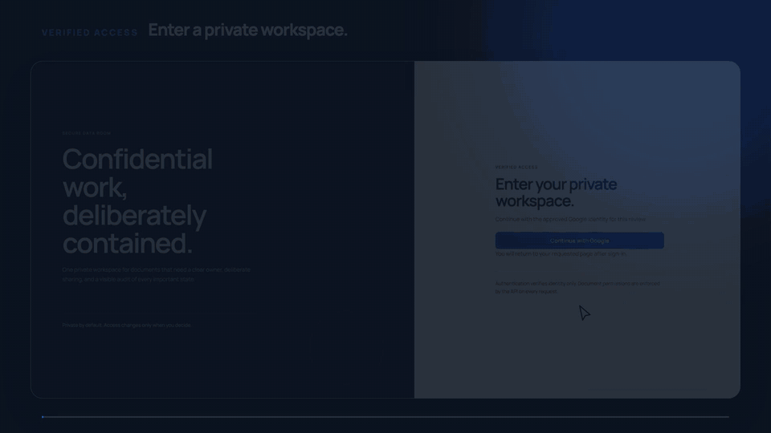
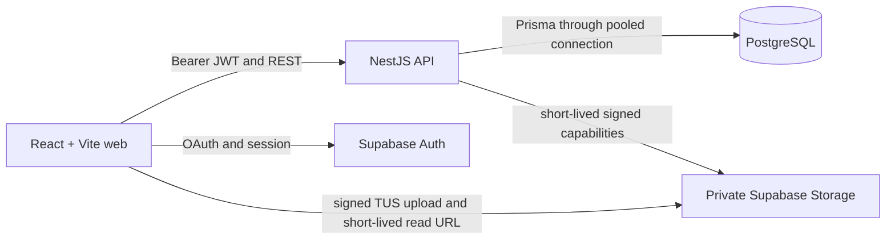
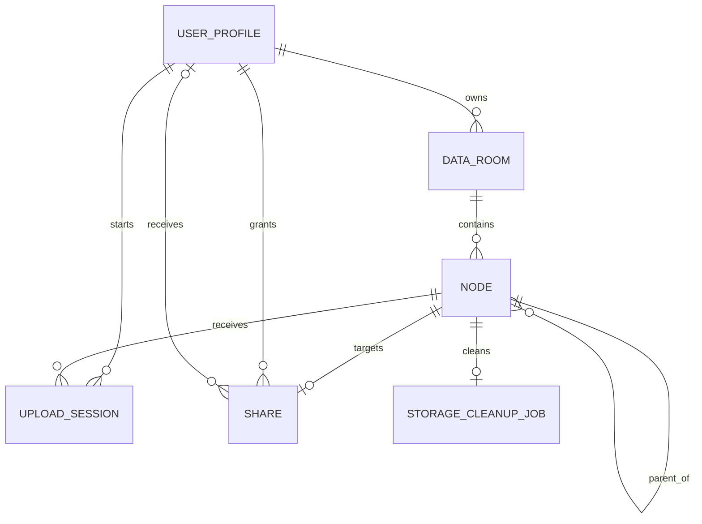

# Secure Data Room

> Share due-diligence PDFs with deliberate, read-only access.
>
> Organize files in folders, upload multiple PDFs, and share only the room, folder, or file a reviewer needs.

[](https://github.com/ewgenij87snwork)
[](https://www.linkedin.com/in/yevgeniy-sorokin-829b7b18a/)

**[Open the live demo](https://secure-data-room-web.vercel.app)** · [Check API health](https://secure-data-room-api.vercel.app/v1/health/ready) · [View source](https://github.com/ewgenij87snwork/secure-data-room)

<p align="center">
  
</p>

The Web and API expose their build identity and are promoted from one verified commit.

## A two-minute reviewer tour

1. Sign in with Google; the application creates a private default Data Room.
2. Create a folder and upload multiple PDFs with independent progress and validation.
3. Open a PDF inline, or use the always-visible download fallback.
4. Share the exact room, folder, or file through a public link or verified recipient email.
5. Open the shared scope in another browser to confirm the read-only boundary.
6. Revoke access from the same Share dialog and verify that the link stops resolving.

The hero uses real application captures from an automated browser walkthrough, then applies a deterministic edit. It preserves the complete cause-and-effect flow: create a folder, add two PDFs, watch both uploads, grant verified read-only access, hand off the invitation, and review the shared document as the recipient.

## Why this MVP is deliberate

- **Private by default:** access changes only through an explicit, visible sharing action.
- **Server-enforced boundaries:** NestJS resolves every owner, recipient, and public-token permission; the UI is never the authority.
- **Small but complete scope:** authentication, hierarchy, upload, viewing, sharing, revocation, and failure states form one reviewable end-to-end workflow.
- **Honest constraints:** search and file versioning remain explicit exclusions instead of partially implemented claims.

## What is implemented

| Capability                                                                   | Status            | Evidence                                                  |
| ---------------------------------------------------------------------------- | ----------------- | --------------------------------------------------------- |
| Google authentication and private owner boundary                             | Implemented       | `apps/api/src/auth/`, `apps/api/src/access-control/`      |
| Nested folders, breadcrumbs, rename, and move                                | Implemented       | `apps/api/src/nodes/`, `apps/web/src/features/data-room/` |
| Multi-PDF drag/drop with per-file progress, retry, cancel, and validation    | Implemented       | `apps/web/src/features/uploads/`, `apps/api/src/uploads/` |
| PDF view, direct-download fallback, and delete flows                         | Implemented       | Web node features and API node tests                      |
| Public-link subtree access and revoke                                        | Implemented       | `apps/api/src/shares/`, public-token tests                |
| Permissioned read-only sharing and Shared with me                            | Implemented       | Share/access-control services and tests                   |
| Loading, empty, offline, conflict, quota, gone, revoked, invalid-link states | Implemented       | Web feature tests and stable API error contracts          |
| Responsive and keyboard-accessible flows                                     | Implemented       | Web component tests and UI contracts                      |
| Filename search and file versioning                                          | Excluded from MVP | Intentionally not implemented or claimed                  |

## Architecture



NestJS is the only application backend and authorization authority. Prisma is the only application-table access path. The browser uses Supabase directly only for identity and narrowly scoped signed Storage operations; it never queries application tables. PDF bytes never pass through a NestJS request body. Storage keys are immutable random identifiers, not user filenames.

### Data model



Source of truth: [`prisma/schema.prisma`](prisma/schema.prisma).

## Security posture and honest limits

- Server-side auth checks issuer, audience, expiry, subject, and JWKS signature; protected reads and mutations pass through `AccessPolicyService`.
- The bucket is private, object keys are random, and public-link secrets are 256-bit random values stored only as SHA-256 digests. Tokens begin in the URL fragment and are removed after capture.
- Public sharing is read-only and scoped to the selected subtree. Revocation blocks new access; an already-issued signed PDF URL has a disclosed maximum residual TTL of 60 seconds.
- Every file view exposes a direct download fallback when the browser cannot embed the PDF.
- PostgreSQL RLS, quotas, runtime kill switches, tombstones, and an idempotent storage cleanup job provide defense in depth.
- This is a take-home MVP, not a compliance certification. Malware scanning, immutable audit logging, retention/backups, enterprise identity, WAF policy, and incident response remain outside this submission.

## Scale decisions

- Recursive PostgreSQL CTEs compute bounded subtree impact and total size; they are also the rebuild/audit path.
- A 100,000-file room lists one parent at a time with keyset pagination over `(kind, normalizedName, id)` and a hard page limit; the whole tree is never rendered.
- `Share` targets a room root, folder, or file and stores `VIEWER`/`EDITOR`; the MVP exposes only view-only sharing.

## Local setup

Prerequisites: Node.js 24.x, Corepack, pnpm 11.17.0, and a disposable PostgreSQL/Supabase development database.

```bash
corepack enable
corepack prepare pnpm@11.17.0 --activate
pnpm install --frozen-lockfile
cp .env.example .env.local
# Fill .env.local with local values; never commit it.
set -a && source ./.env.local && set +a
pnpm prisma:generate
pnpm prisma:migrate:dev
pnpm dev
```

Local Web is `http://localhost:5173`, API is `http://localhost:3000/v1`, and Swagger is `http://localhost:3000/docs`. Keep server-only credentials out of `VITE_*`.

## Verification

```bash
pnpm architecture:check
pnpm placeholders:check
pnpm format:check
git diff --check
pnpm verify
```

The deployed release identity can be checked with:

```bash
pnpm deployment:sha:check -- \
  --web-url https://secure-data-room-web.vercel.app \
  --api-url https://secure-data-room-api.vercel.app
```

## Deliberate trade-offs

- One default room per owner keeps the deadline model small; multiple rooms would need an explicit default-room choice.
- Tombstones and cleanup-job records are the recoverable deadline-build boundary; production needs a reviewed retention and purge policy.
- Search and file versioning are optional assignment extras and intentionally excluded from this MVP.
- Codex helped with requirement extraction, implementation, adversarial review, traceability, and documentation. Playwright captured real browser states; Remotion and FFmpeg produced the deterministic reviewer tour. The engineer selected the scope, inspected the implementation, made the security decisions, and owns every accepted change; AI output is not treated as evidence.

## Creator

Built and submitted by **Yevgeniy Sorokin**.

<a href="https://github.com/ewgenij87snwork" aria-label="Yevgeniy Sorokin on GitHub"></a>
<a href="https://www.linkedin.com/in/yevgeniy-sorokin-829b7b18a/" aria-label="Yevgeniy Sorokin on LinkedIn"></a>

## License

No public reuse license is granted until the take-home owner confirms that publication is permitted.
