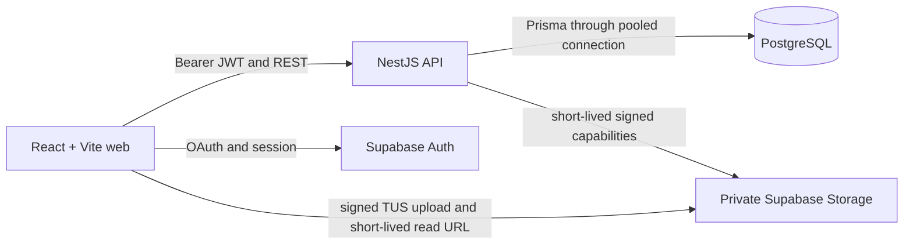
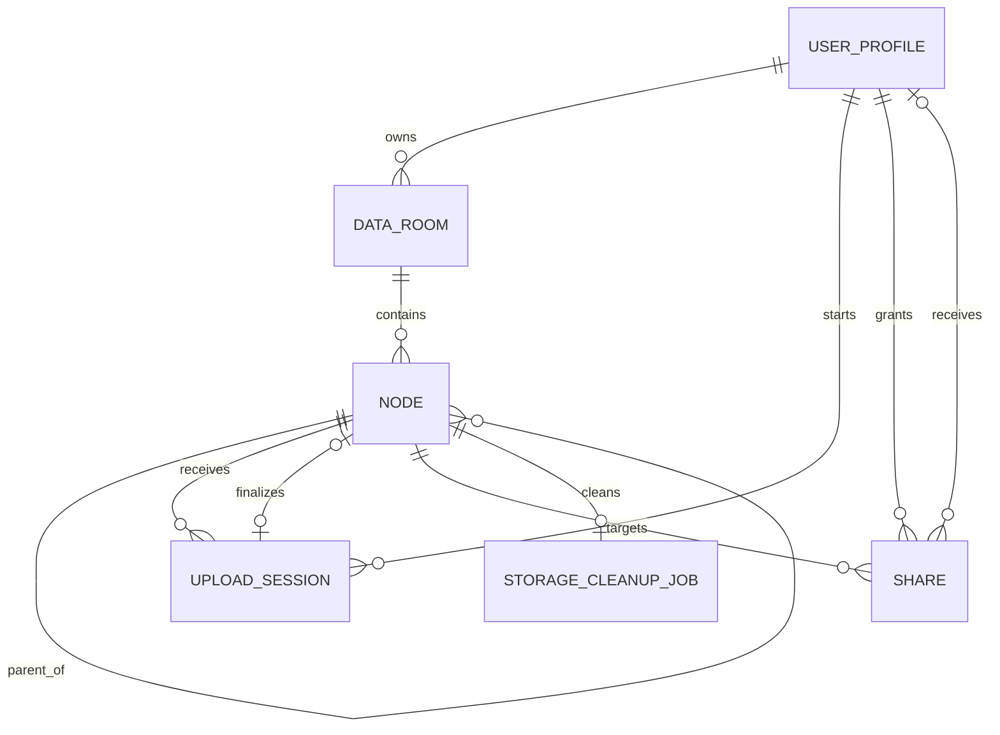

# Secure Data Room

> A production-minded Data Room MVP for organizing and securely sharing due-diligence PDFs.

## Live URLs

Deployment is pending P7. There are no public frontend or backend URLs yet; this README contains no
placeholder or fabricated URL. Local URLs are listed below.

## Two-minute tour

The implemented reviewer path is:

1. Sign in with Google; the owner receives a private default Data Room.
2. Create nested folders such as `Legal/Contracts` and navigate with breadcrumbs.
3. Add multiple PDFs by drag-and-drop or file picker. Each upload has independent progress, retry,
   cancel, and validation state.
4. Open a PDF, rename it, move it, and delete it. Same-folder conflicts return a safe suggestion.
5. Share a room, folder, or file with a public link or a permissioned read-only share.
6. Revoke access and observe the deliberate revoked/gone state on the next protected request.
7. Delete a folder after reviewing its recursive folder/file/byte/share impact.

The public-link, second-user, and deployed journeys are implementation targets with repository tests;
their production smoke evidence is pending P7.

## Current implementation and evidence

“Implemented” below means the source and focused tests for the behavior are present in this checkout.
It does not mean that an external database, blob bucket, or deployment was verified. No final
`docs/execution/EVIDENCE.md` exists yet, so cloud and final-SHA claims remain explicitly open.

| Capability                                                                   | Current state                                         | Evidence in this repository                                             |
| ---------------------------------------------------------------------------- | ----------------------------------------------------- | ----------------------------------------------------------------------- |
| Google authentication and private owner boundary                             | Implemented; deployment proof pending                 | `apps/api/src/auth/`, `apps/api/src/access-control/`, web auth tests    |
| Nested folders, contents, breadcrumbs, and rename                            | Implemented; DB execution not claimed                 | `apps/api/src/nodes/`, `apps/web/src/features/data-room/`, node tests   |
| Recursive delete with impact preview and cleanup job                         | Implemented; DB execution not claimed                 | `apps/api/src/nodes/delete.*`, `apps/api/src/cleanup/`, delete tests    |
| Multi-PDF drag/drop with per-file progress                                   | Implemented; Storage proof pending                    | `apps/web/src/features/uploads/`, `apps/api/src/uploads/`, upload tests |
| PDF view, rename, move, and delete                                           | Implemented; Storage proof pending                    | PDF viewer and node feature tests                                       |
| Public-link subtree access and revoke                                        | Implemented; deployed smoke pending                   | `apps/api/src/shares/`, public-token tests, access-policy tests         |
| Permissioned read-only sharing and Shared with me                            | Implemented; deployed smoke pending                   | share/access-control services and tests                                 |
| Loading, empty, offline, conflict, quota, gone, revoked, invalid-link states | Implemented in UI/contracts; browser smoke pending    | web feature tests and stable contract errors                            |
| Responsive and keyboard-accessible flows                                     | Implemented in UI; final accessibility review pending | web components/tests; `docs/execution/FINAL-ACCEPTANCE.md` checklist    |
| Frontend/backend deployed at one Git SHA                                     | Not evidenced; pending P7                             | No deployment URLs or final-SHA evidence yet                            |
| Filename search                                                              | Excluded from this build                              | Optional scope is not implemented or claimed                            |
| File versioning                                                              | Excluded from this build                              | Optional scope is not implemented or claimed                            |

## Architecture



NestJS is the only application backend and authorization authority. Prisma is the only application-
table access path. The browser uses Supabase directly only for identity and narrowly scoped signed
Storage operations; it never queries application tables. PDF bytes never pass through a NestJS request
body. Storage keys are immutable random identifiers, not user filenames.

## Design decisions

- React/Vite is an interaction-heavy authenticated SPA; a second Next.js server runtime would add no
  required SSR, SEO, or BFF responsibility.
- `Node` is an adjacency list for room roots, folders, and files. One share target model therefore
  covers a room root, folder, or file.
- Direct signed TUS uploads keep PDF bodies out of the function request path while preserving per-file
  progress. Finalization is idempotent and verifies the stored object.
- PostgreSQL partial unique indexes remain authoritative for active sibling names and room roots;
  application checks only improve errors and suggestions.
- Deletion tombstones the subtree, revokes affected shares, and enqueues one idempotent cleanup job.
  Database and object storage cannot participate in one transaction.

## Data model / ERD



The Prisma source of truth is [`prisma/schema.prisma`](prisma/schema.prisma), with the reviewed SQL
in [`prisma/migrations/20260817000000_foundation/migration.sql`](prisma/migrations/20260817000000_foundation/migration.sql).
`RuntimeControl` is a singleton operational table and is intentionally omitted from the relationship
diagram because it has no foreign-key relationship.

## How it scales

### How is whole-subtree item count and total size computed?

The correctness path is a room-scoped recursive PostgreSQL CTE from the selected node. It counts
active descendant folders/files and sums `sizeBytes` for active file nodes. The same bounded traversal
drives delete impact. If measured read volume requires it, maintained ancestor counters or an
asynchronous aggregate with reconciliation can serve repeated display reads; the CTE remains the
rebuild/audit path.

### What changes when one Data Room holds 100,000 files?

List one parent at a time with keyset pagination over `(kind, normalizedName, id)` and a hard page
limit; never fetch or render the whole tree. The active-children partial index is scoped by room and
parent. Breadcrumbs use an upward recursive query; downward traversal is reserved for bounded impact
and cleanup work. Virtualize only a genuinely large visible page. If search is later implemented, add
a room-scoped normalized trigram/GIN index with its own migration rather than carrying unused search
infrastructure in this build.

### How does sharing extend to viewer/editor roles without remodeling?

`Share` already targets any `Node` and stores `ShareRole` (`VIEWER` or `EDITOR`). `AccessPolicyService`
resolves the effective role for the target subtree. The deadline UI grants read-only access; enabling
editors requires only an explicit policy matrix for allowed mutations, not a new share or target model.

## Edge cases

- Database uniqueness handles concurrent same-name writes; the loser receives `NAME_CONFLICT` and a
  bounded suggestion rather than overwriting.
- Mixed upload batches keep invalid, failed, cancelled, and successful files independent.
- Duplicate finalize, delete, and revoke operations are idempotent.
- Deleting a shared/viewed subtree makes it unreadable immediately and returns a deliberate gone state.
- Email shares bind to the immutable authenticated user ID when the recipient first registers.
- Cross-room IDs and sibling/ancestor escapes fail closed without private metadata leakage.
- Public-link secrets start in the URL fragment, are removed after capture, and only their SHA-256
  digest is stored.
- A signed PDF URL already issued cannot be revoked retroactively; the residual maximum TTL is 60
  seconds and no new URL is issued after revoke/delete.
- Storage deletion failure leaves content logically unavailable and retries through one cleanup job.
- Revision compare-and-swap rejects stale rename/move tabs instead of silently losing updates.

## Security and honest limitations

JWT issuer, audience, expiry, subject, and JWKS signature are checked server-side. Every protected
read and mutation passes through `AccessPolicyService`; PostgreSQL RLS and revoked browser grants are
defense in depth. The bucket is private, object keys are random, public tokens are 256-bit random
secrets stored only as hashes, and application quotas plus runtime kill switches bound free-tier
abuse. Provider/WAF rate limiting remains an explicit P7 deployment configuration, not a repository
claim.

The MVP does not perform malware scanning, immutable audit logging, retention/backups, enterprise
identity, or compliance certification. It is production-minded, not safe for real acquisition data
without those controls and an operational review. Static security scanning is a repository guard, not
a security certification. Deployment and shutdown controls are documented in
[`docs/execution/DEPLOYMENT-AND-SHUTDOWN.md`](docs/execution/DEPLOYMENT-AND-SHUTDOWN.md).

## Repository map

```text
apps/web/       React/Vite browser application
apps/api/       NestJS application backend
packages/       Shared Zod contracts and stable error codes
prisma/         Schema, migration, seed, and database invariants
tests/e2e/      Playwright journey definitions
docs/architecture/  Architecture decisions
docs/execution/     Traceability, acceptance, security, and operations
docs/ai/            AI assistance and human ownership
```

## Clean local setup

Prerequisites: Node.js 24.x, Corepack, pnpm 11.17.0, and a disposable PostgreSQL/Supabase
development database. From a clean clone:

```bash
corepack enable
corepack prepare pnpm@11.17.0 --activate
pnpm install --frozen-lockfile
cp .env.example .env.local
set -a
source ./.env.local
set +a
pnpm prisma:generate
pnpm prisma:migrate:dev
pnpm dev
```

Set the values documented in `.env.example` before sourcing the file. The explicit export makes the
variables available to Prisma and Vite and, importantly, to the NestJS process, whose `getEnv` reads
from `process.env` rather than `.env.local`. Keep server-only credentials out of `VITE_*`. Local
endpoints are `http://localhost:5173`, API
`http://localhost:3000/v1`, and Swagger `http://localhost:3000/docs`.

## Verification commands

Focused repository checks:

```bash
pnpm architecture:check
pnpm requirements:check
pnpm placeholders:check
pnpm format:check
git diff --check
```

The consolidated gate is:

```bash
pnpm verify
```

`pnpm verify` includes builds, type checks, tests, generated-artifact checks, security scanning, and
the focused checks above. Database integration tests require the configured disposable database;
deployed E2E requires P7 URLs and credentials. Neither is represented as completed here.

## Deployment and shutdown

P7 will deploy the web and API as separate Vercel projects from one commit SHA, with Supabase Auth,
PostgreSQL, and private Storage. Migrations run separately; they never run during API startup. The
exact environment names, provider setup, release probes, lockdown, emergency stop, and teardown order
are in [`docs/execution/DEPLOYMENT-AND-SHUTDOWN.md`](docs/execution/DEPLOYMENT-AND-SHUTDOWN.md).

Useful operational commands after deployment:

```bash
pnpm ops:status
pnpm ops:lockdown -- --confirm
pnpm ops:maintenance:on -- --confirm
```

## AI usage and human judgement

AI was used in the working session for requirement extraction, architecture/document review,
traceability checks, prose drafting, and adversarial questions about security, scaling, and edge cases.
The engineer selected the scope, checked the current implementation and Prisma model, chose the claims
that this README makes, edited the final documentation, and owns every accepted change and verification
result. AI output, mocks, and planned deployment are not evidence.

The detailed record is in [`docs/ai/AI-USAGE.md`](docs/ai/AI-USAGE.md).

## Trade-offs and excluded scope

- One default room per owner keeps the deadline model small; multiple rooms would need an explicit
  default-room choice and removal of the temporary owner uniqueness invariant.
- Tombstones and cleanup-job records remain as the recoverable deadline-build boundary; production
  needs a reviewed retention/purge policy.
- Search and file versioning are optional assignment extras and are intentionally not implemented or
  claimed.
- Signed-read revocation has a disclosed residual TTL because provider-issued URLs are bearer
  capabilities.

## License

No public reuse license is granted until the take-home owner confirms that publication is permitted.
